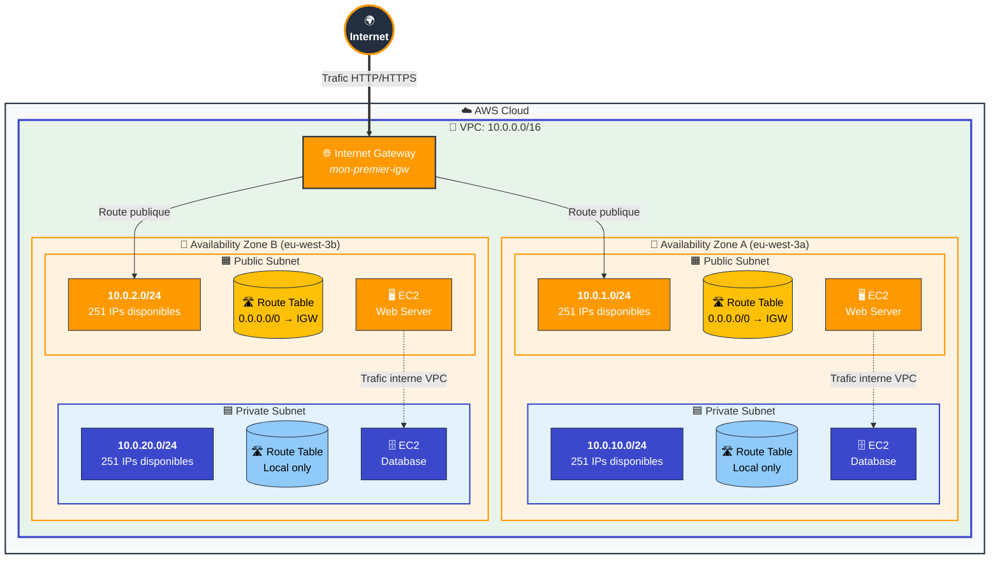
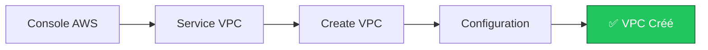
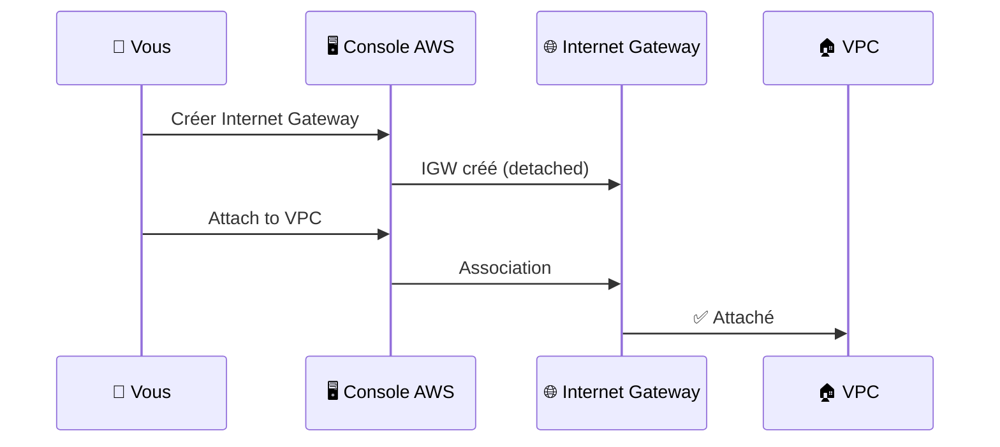
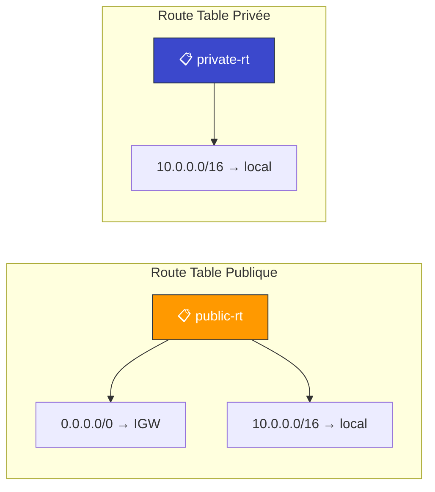
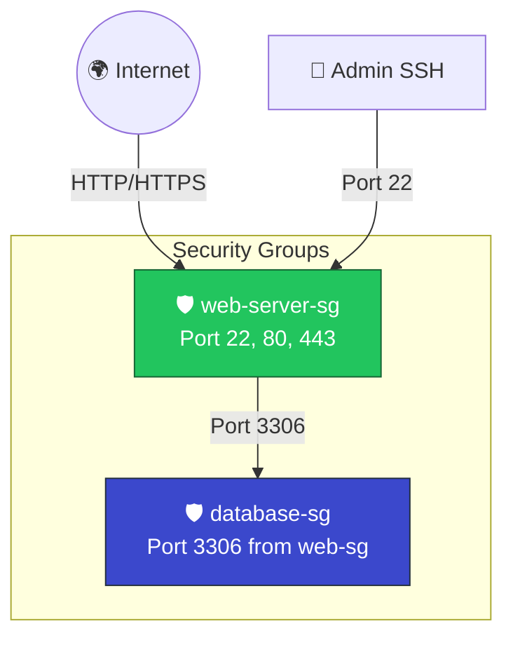
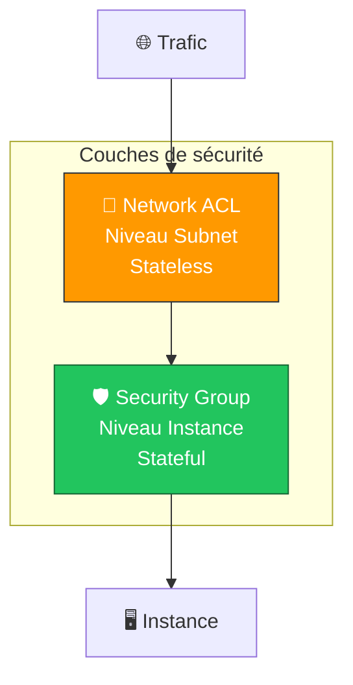

# Exercice 01 : Création Manuelle d'un VPC AWS

## 🎯 Objectifs pédagogiques

À la fin de cet exercice, vous serez capable de :
- Comprendre l'architecture réseau AWS (VPC, Subnets, Route Tables, IGW)
- Créer un VPC from scratch via la console AWS
- Configurer des subnets publics et privés
- Mettre en place le routage internet (sans NAT Gateway)
- Appliquer les bonnes pratiques de sécurité avec les Security Groups et NACLs

## 📚 Prérequis

- Un compte AWS (Free Tier suffit)
- Accès à la console AWS
- Connaissances de base en réseau (IP, CIDR, routage)

## 🏗️ Architecture cible

## 📋 Plan d'adressage IP

| Composant | CIDR Block | Description |
|-----------|------------|-------------|
| VPC | 10.0.0.0/16 | Réseau principal (65 536 IPs) |
| Public Subnet AZ-A | 10.0.1.0/24 | Subnet public zone A (251 IPs) |
| Public Subnet AZ-B | 10.0.2.0/24 | Subnet public zone B (251 IPs) |
| Private Subnet AZ-A | 10.0.10.0/24 | Subnet privé zone A (251 IPs) |
| Private Subnet AZ-B | 10.0.20.0/24 | Subnet privé zone B (251 IPs) |

> 💡 **Note** : AWS réserve 5 adresses IP par subnet (les 4 premières et la dernière)

---

## 📖 Étapes de l'exercice

### Étape 1 : Créer le VPC

1. Connectez-vous à la **Console AWS**
2. Accédez au service **VPC** (recherchez "VPC" dans la barre de recherche)
3. Cliquez sur **"Create VPC"**
4. Configurez comme suit :

| Paramètre | Valeur |
|-----------|--------|
| Resources to create | VPC only |
| Name tag | `mon-premier-vpc` |
| IPv4 CIDR block | `10.0.0.0/16` |
| IPv6 CIDR block | No IPv6 CIDR block |
| Tenancy | Default |

5. Cliquez sur **"Create VPC"**

---

### Étape 2 : Activer les DNS Settings

1. Sélectionnez votre VPC nouvellement créé
2. Cliquez sur **"Actions"** → **"Edit VPC settings"**
3. Cochez les options :
   - ✅ Enable DNS hostnames
   - ✅ Enable DNS resolution
4. Cliquez sur **"Save"**

> ⚠️ **Important** : Sans ces paramètres, vos instances EC2 n'auront pas de noms DNS publics.

---

### Étape 3 : Créer l'Internet Gateway

L'Internet Gateway permet à votre VPC de communiquer avec Internet.

1. Dans le menu latéral, cliquez sur **"Internet gateways"**
2. Cliquez sur **"Create internet gateway"**
3. Configurez :

| Paramètre | Valeur |
|-----------|--------|
| Name tag | `mon-premier-igw` |

4. Cliquez sur **"Create internet gateway"**
5. **IMPORTANT** : Attachez l'IGW au VPC
   - Cliquez sur **"Actions"** → **"Attach to VPC"**
   - Sélectionnez `mon-premier-vpc`
   - Cliquez sur **"Attach internet gateway"**

---

### Étape 4 : Créer les Subnets

#### 4.1 Subnet Public - Availability Zone A

1. Dans le menu latéral, cliquez sur **"Subnets"**
2. Cliquez sur **"Create subnet"**
3. Configurez :

| Paramètre | Valeur |
|-----------|--------|
| VPC ID | mon-premier-vpc |
| Subnet name | `public-subnet-az-a` |
| Availability Zone | eu-west-3a (ou votre région) |
| IPv4 CIDR block | `10.0.1.0/24` |

4. Cliquez sur **"Create subnet"**

#### 4.2 Subnet Public - Availability Zone B

Répétez l'opération avec :

| Paramètre | Valeur |
|-----------|--------|
| VPC ID | mon-premier-vpc |
| Subnet name | `public-subnet-az-b` |
| Availability Zone | eu-west-3b |
| IPv4 CIDR block | `10.0.2.0/24` |

#### 4.3 Subnet Privé - Availability Zone A

| Paramètre | Valeur |
|-----------|--------|
| VPC ID | mon-premier-vpc |
| Subnet name | `private-subnet-az-a` |
| Availability Zone | eu-west-3a |
| IPv4 CIDR block | `10.0.10.0/24` |

#### 4.4 Subnet Privé - Availability Zone B

| Paramètre | Valeur |
|-----------|--------|
| VPC ID | mon-premier-vpc |
| Subnet name | `private-subnet-az-b` |
| Availability Zone | eu-west-3b |
| IPv4 CIDR block | `10.0.20.0/24` |

---

### Étape 5 : Activer l'auto-assign IP publique pour les subnets publics

1. Sélectionnez `public-subnet-az-a`
2. **"Actions"** → **"Edit subnet settings"**
3. Cochez ✅ **"Enable auto-assign public IPv4 address"**
4. Cliquez sur **"Save"**
5. Répétez pour `public-subnet-az-b`

---

### Étape 6 : Créer les Route Tables

#### 6.1 Route Table Publique

1. Dans le menu latéral, cliquez sur **"Route tables"**
2. Cliquez sur **"Create route table"**
3. Configurez :

| Paramètre | Valeur |
|-----------|--------|
| Name | `public-route-table` |
| VPC | mon-premier-vpc |

4. Cliquez sur **"Create route table"**

5. **Ajouter la route vers Internet** :
   - Sélectionnez la route table créée
   - Onglet **"Routes"** → **"Edit routes"**
   - Cliquez sur **"Add route"**
   
| Destination | Target |
|-------------|--------|
| 0.0.0.0/0 | Internet Gateway (mon-premier-igw) |

6. **Associer aux subnets publics** :
   - Onglet **"Subnet associations"** → **"Edit subnet associations"**
   - Cochez `public-subnet-az-a` et `public-subnet-az-b`
   - Cliquez sur **"Save associations"**

#### 6.2 Route Table Privée

1. Créez une nouvelle route table `private-route-table`
2. Associez-la aux subnets `private-subnet-az-a` et `private-subnet-az-b`
3. **Ne pas ajouter de route vers Internet** (les instances privées ne doivent pas être accessibles depuis Internet)

> 💡 **Sans NAT Gateway** : Les instances dans les subnets privés ne peuvent pas accéder à Internet pour les mises à jour. C'est une limitation volontaire de cet exercice pour rester dans le Free Tier.

---

### Étape 7 : Créer les Security Groups

#### 7.1 Security Group pour serveurs Web

1. Dans le menu latéral, cliquez sur **"Security groups"**
2. Cliquez sur **"Create security group"**
3. Configurez :

| Paramètre | Valeur |
|-----------|--------|
| Security group name | `web-server-sg` |
| Description | Security group for web servers |
| VPC | mon-premier-vpc |

4. **Inbound rules** (règles entrantes) :

| Type | Protocol | Port | Source | Description |
|------|----------|------|--------|-------------|
| SSH | TCP | 22 | My IP | Admin SSH access |
| HTTP | TCP | 80 | 0.0.0.0/0 | Web traffic |
| HTTPS | TCP | 443 | 0.0.0.0/0 | Secure web traffic |

5. **Outbound rules** : Laissez par défaut (tout le trafic sortant autorisé)

#### 7.2 Security Group pour bases de données

1. Créez un nouveau security group `database-sg`
2. **Inbound rules** :

| Type | Protocol | Port | Source | Description |
|------|----------|------|--------|-------------|
| MySQL/Aurora | TCP | 3306 | web-server-sg | MySQL from web servers |

> 🔐 **Bonne pratique** : La source est le security group `web-server-sg`, pas une IP. Ainsi, seules les instances dans ce SG peuvent accéder à la base de données.

---

### Étape 8 : Créer les Network ACLs (optionnel mais recommandé)

Les NACLs sont des firewalls au niveau subnet (stateless).

Pour cet exercice, nous utilisons les NACLs par défaut qui autorisent tout le trafic.

---

## ✅ Validation de l'exercice

### Checklist de vérification

- [ ] VPC créé avec CIDR 10.0.0.0/16
- [ ] DNS hostnames et DNS resolution activés
- [ ] Internet Gateway créé et attaché au VPC
- [ ] 2 subnets publics créés (10.0.1.0/24 et 10.0.2.0/24)
- [ ] 2 subnets privés créés (10.0.10.0/24 et 10.0.20.0/24)
- [ ] Auto-assign public IP activé sur les subnets publics
- [ ] Route table publique avec route vers IGW
- [ ] Route table privée associée aux subnets privés
- [ ] Security groups créés (web-server-sg et database-sg)

### Test pratique

Pour valider votre configuration, lancez une instance EC2 dans le subnet public :

1. Allez dans **EC2** → **Launch instance**
2. Choisissez **Amazon Linux 2023** (Free Tier)
3. Dans **Network settings** :
   - VPC : `mon-premier-vpc`
   - Subnet : `public-subnet-az-a`
   - Auto-assign public IP : Enable
   - Security group : `web-server-sg`
4. Lancez l'instance et vérifiez que vous pouvez y accéder en SSH

---

## 🧹 Nettoyage

Pour éviter des frais, supprimez les ressources dans cet ordre :

1. Terminer les instances EC2
2. Supprimer les Security Groups (sauf default)
3. Supprimer les Subnets
4. Détacher et supprimer l'Internet Gateway
5. Supprimer les Route Tables (sauf main)
6. Supprimer le VPC

---

## 📚 Pour aller plus loin

- [Documentation AWS VPC](https://docs.aws.amazon.com/vpc/latest/userguide/)
- [VPC Sizing Best Practices](https://aws.amazon.com/blogs/networking-and-content-delivery/vpc-sharing-a-new-approach-to-multiple-accounts-and-vpc-management/)
- Prochain exercice : Ajouter un NAT Gateway pour permettre aux instances privées d'accéder à Internet

---

## 🎓 Quiz de validation

1. Pourquoi avons-nous besoin d'un Internet Gateway ?
2. Quelle est la différence entre un subnet public et privé ?
3. Pourquoi les Security Groups sont-ils "stateful" ?
4. Combien d'adresses IP sont réellement disponibles dans un /24 sur AWS ?
5. Que se passe-t-il si une instance privée essaie d'accéder à Internet sans NAT Gateway ?

📝 Réponses

1. L'IGW permet aux ressources du VPC avec une IP publique de communiquer avec Internet
2. Un subnet public a une route vers l'IGW (0.0.0.0/0 → IGW), pas le privé
3. Stateful = le trafic de retour est automatiquement autorisé
4. 251 (256 - 5 réservées par AWS)
5. La connexion échoue car il n'y a pas de route vers Internet

