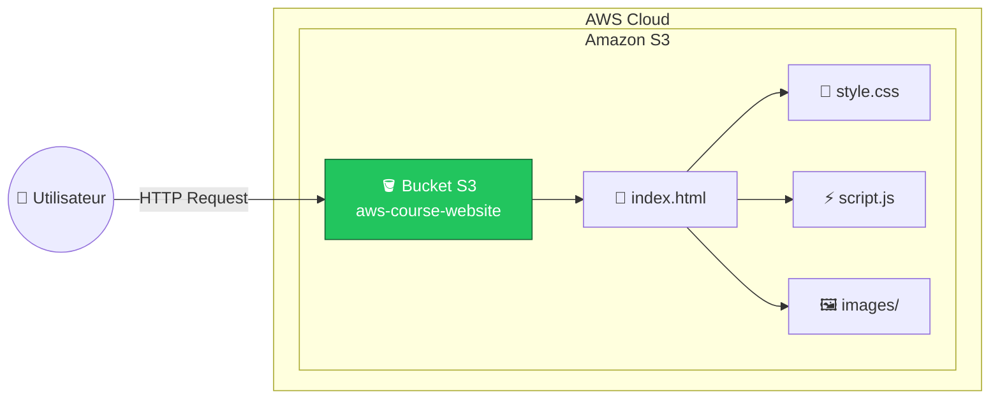
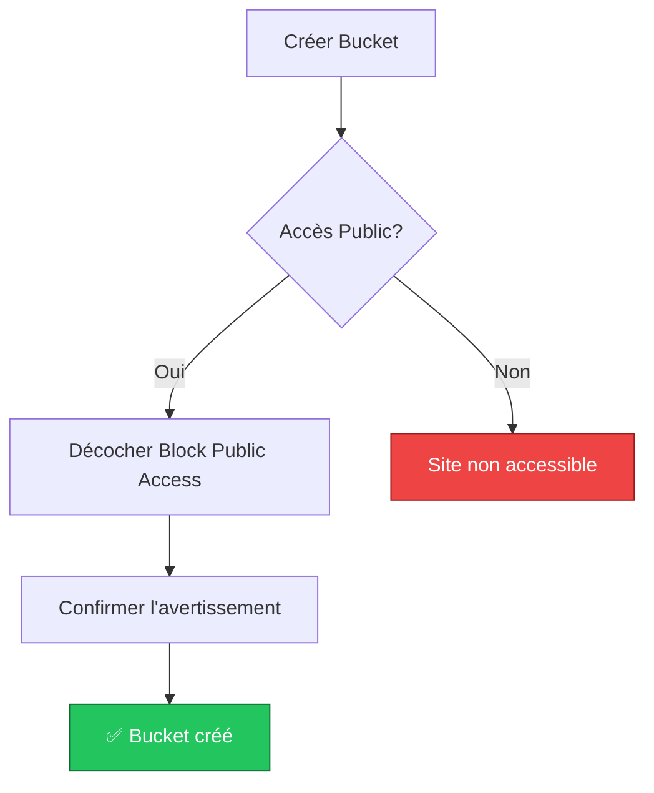

# Exercice 02 : Déployer un Site Web Statique sur Amazon S3

## 🎯 Objectifs pédagogiques

À la fin de cet exercice, vous serez capable de :
- Créer et configurer un bucket S3 pour l'hébergement web statique
- Comprendre les politiques de bucket et les permissions publiques
- Déployer un site web moderne avec Tailwind CSS
- Configurer un domaine personnalisé (optionnel)

## 📚 Prérequis

- Un compte AWS (Free Tier suffit)
- Connaissances de base en HTML/CSS
- Un éditeur de texte

## 🏗️ Architecture



---

## 📖 Partie 1 : Création du Bucket S3

### Étape 1 : Créer le bucket

1. Connectez-vous à la **Console AWS**
2. Accédez au service **S3**
3. Cliquez sur **"Create bucket"**
4. Configurez :

| Paramètre | Valeur |
|-----------|--------|
| Bucket name | `votre-nom-aws-course-website` (doit être unique globalement) |
| AWS Region | eu-west-3 (Paris) ou votre région |
| Object Ownership | ACLs disabled |
| Block Public Access | **Décocher** "Block all public access" ⚠️ |
| Bucket Versioning | Disable |

5. Cochez la case de confirmation pour l'accès public
6. Cliquez sur **"Create bucket"**



### Étape 2 : Activer l'hébergement statique

1. Sélectionnez votre bucket
2. Onglet **"Properties"**
3. Scrollez jusqu'à **"Static website hosting"**
4. Cliquez sur **"Edit"**
5. Configurez :

| Paramètre | Valeur |
|-----------|--------|
| Static website hosting | Enable |
| Hosting type | Host a static website |
| Index document | index.html |
| Error document | error.html |

6. Cliquez sur **"Save changes"**
7. **Notez l'URL du website** (format : `http://bucket-name.s3-website-region.amazonaws.com`)

### Étape 3 : Configurer la politique du bucket

1. Onglet **"Permissions"**
2. Section **"Bucket policy"** → **"Edit"**
3. Collez cette politique (remplacez `VOTRE-NOM-BUCKET`) :

```json
{
    "Version": "2012-10-17",
    "Statement": [
        {
            "Sid": "PublicReadGetObject",
            "Effect": "Allow",
            "Principal": "*",
            "Action": "s3:GetObject",
            "Resource": "arn:aws:s3:::VOTRE-NOM-BUCKET/*"
        }
    ]
}
```

4. Cliquez sur **"Save changes"**

---

## 📖 Partie 2 : Le Site Web - Cours AWS avec Tailwind CSS

Nous allons maintenant créer un magnifique site web présentant les services AWS de base.

### Structure des fichiers

```
website/
├── index.html          # Page principale
├── error.html          # Page d'erreur 404
├── css/
│   └── custom.css      # Styles personnalisés
├── js/
│   └── main.js         # Scripts JavaScript
└── images/
    └── aws-logo.svg    # Logo AWS
```

---

## 📖 Partie 3 : Déploiement

### Étape 1 : Upload des fichiers

1. Dans votre bucket S3
2. Cliquez sur **"Upload"**
3. Glissez-déposez tous les fichiers du dossier `website/`
4. Conservez la structure des dossiers
5. Cliquez sur **"Upload"**

### Étape 2 : Vérifier le déploiement

1. Retournez dans **Properties** → **Static website hosting**
2. Cliquez sur l'URL du website
3. Votre site devrait s'afficher ! 🎉

---

## ✅ Validation de l'exercice

### Checklist

- [ ] Bucket S3 créé avec nom unique
- [ ] Accès public configuré correctement
- [ ] Hébergement statique activé
- [ ] Politique de bucket appliquée
- [ ] Fichiers uploadés
- [ ] Site accessible via l'URL S3

### Tests à effectuer

1. Accéder à l'URL du site
2. Naviguer entre les différentes sections
3. Vérifier que le mode sombre fonctionne
4. Tester sur mobile (responsive)
5. Accéder à une page inexistante → page error.html

---

## 🧹 Nettoyage

Pour éviter des frais :

1. Videz le bucket (sélectionner tous les objets → Delete)
2. Supprimez le bucket

```bash
# Ou via CLI
aws s3 rm s3://votre-nom-bucket --recursive
aws s3 rb s3://votre-nom-bucket
```

---

## 🚀 Pour aller plus loin

- **CloudFront** : Ajouter un CDN pour de meilleures performances
- **Route 53** : Configurer un nom de domaine personnalisé
- **Certificate Manager** : Ajouter HTTPS gratuit
- **CI/CD** : Automatiser le déploiement avec GitHub Actions

---

## 📚 Ressources

- [Documentation S3 Static Hosting](https://docs.aws.amazon.com/AmazonS3/latest/userguide/WebsiteHosting.html)
- [Tailwind CSS Documentation](https://tailwindcss.com/docs)
- [AWS Free Tier](https://aws.amazon.com/free/)
