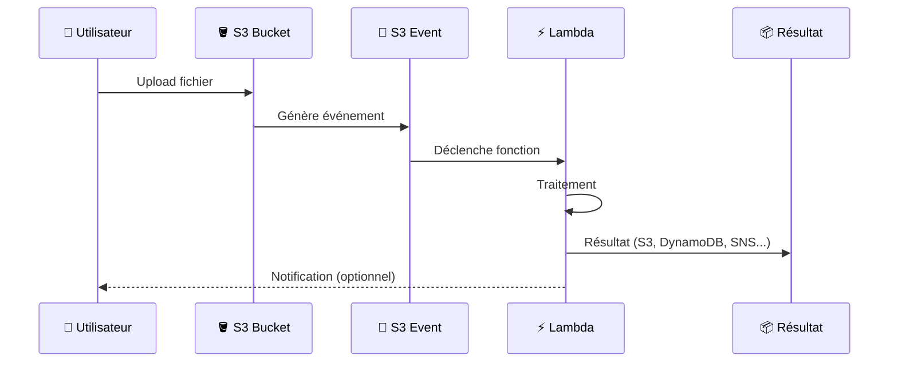
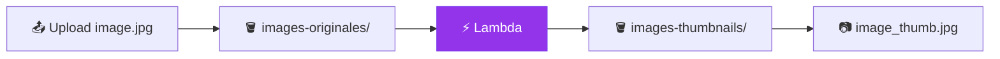
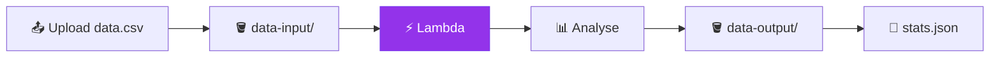
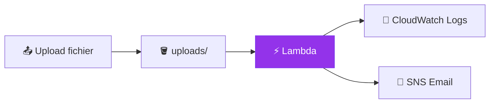
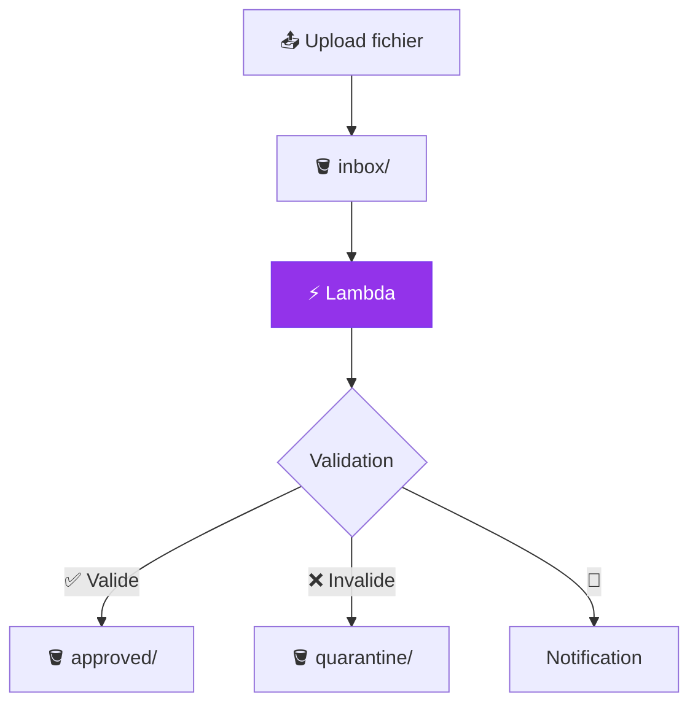
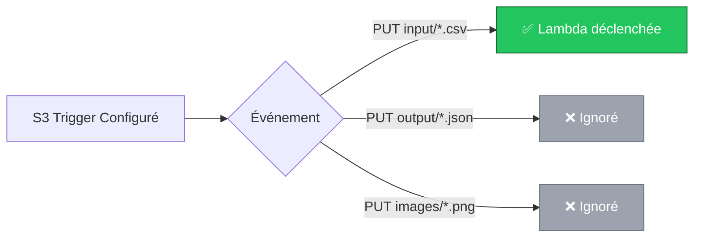
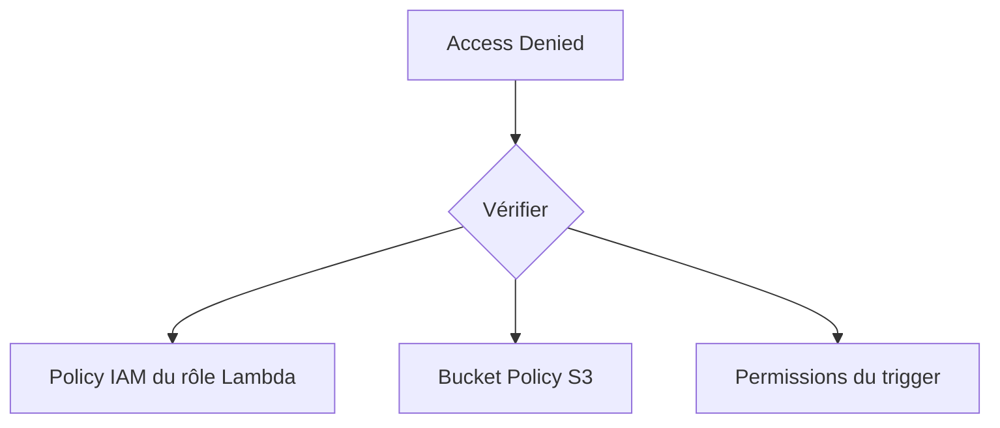

# Exercice 03 : Lambda + S3 Trigger - Traitement Automatique de Fichiers

## 🎯 Objectifs pédagogiques

À la fin de cet exercice, vous serez capable de :
- Créer une fonction AWS Lambda
- Configurer un trigger S3 pour déclencher Lambda automatiquement
- Gérer les permissions IAM entre services
- Implémenter différents scénarios de traitement de fichiers

## 📚 Prérequis

- Compte AWS (Free Tier)
- Exercice 02 complété (bucket S3)
- Connaissances de base en Python ou Node.js

## 🏗️ Architecture



---

## 🎮 Scénarios Proposés

Choisissez le scénario qui vous intéresse le plus !

### 🖼️ Scénario A : Générateur de Miniatures d'Images

**Difficulté :** ⭐⭐ Intermédiaire

Lorsqu'une image est uploadée, Lambda génère automatiquement une miniature.



---

### 📊 Scénario B : Analyseur de Fichiers CSV

**Difficulté :** ⭐ Débutant

Lorsqu'un fichier CSV est uploadé, Lambda l'analyse et stocke les statistiques.



---

### 📝 Scénario C : Système de Log et Notification

**Difficulté :** ⭐ Débutant

Chaque upload génère un log et envoie une notification par email.



---

### 🔐 Scénario D : Validation et Quarantaine de Fichiers

**Difficulté :** ⭐⭐⭐ Avancé

Les fichiers uploadés sont analysés et déplacés selon leur validité.



---

## 📖 Guide Détaillé - Scénario B : Analyseur CSV

Ce scénario est recommandé pour les débutants.

### Étape 1 : Créer le Bucket S3

1. Accédez à **S3** dans la console AWS
2. Créez un bucket : `votre-nom-csv-analyzer`
3. Créez deux dossiers dans le bucket :
   - `input/` - pour les fichiers CSV à analyser
   - `output/` - pour les résultats

### Étape 2 : Créer le Rôle IAM pour Lambda

1. Accédez à **IAM** → **Roles** → **Create role**
2. Sélectionnez **AWS Service** → **Lambda**
3. Attachez les policies :
   - `AWSLambdaBasicExecutionRole` (logs CloudWatch)
   - Créez une policy personnalisée pour S3 :

```json
{
    "Version": "2012-10-17",
    "Statement": [
        {
            "Effect": "Allow",
            "Action": [
                "s3:GetObject",
                "s3:PutObject"
            ],
            "Resource": [
                "arn:aws:s3:::votre-nom-csv-analyzer/*"
            ]
        }
    ]
}
```

4. Nommez le rôle : `lambda-csv-analyzer-role`

### Étape 3 : Créer la Fonction Lambda

1. Accédez à **Lambda** → **Create function**
2. Configurez :

| Paramètre | Valeur |
|-----------|--------|
| Function name | `csv-analyzer` |
| Runtime | Python 3.12 |
| Architecture | x86_64 |
| Execution role | lambda-csv-analyzer-role |

3. Collez le code suivant :

```python
import json
import boto3
import csv
from io import StringIO
from datetime import datetime

s3_client = boto3.client('s3')

def lambda_handler(event, context):
    """
    Analyse un fichier CSV uploadé sur S3 et génère des statistiques.
    """
    # Récupérer les informations de l'événement S3
    bucket = event['Records'][0]['s3']['bucket']['name']
    key = event['Records'][0]['s3']['object']['key']
    
    print(f"📁 Traitement du fichier: s3://{bucket}/{key}")
    
    try:
        # Télécharger le fichier CSV
        response = s3_client.get_object(Bucket=bucket, Key=key)
        content = response['Body'].read().decode('utf-8')
        
        # Analyser le CSV
        csv_reader = csv.DictReader(StringIO(content))
        rows = list(csv_reader)
        
        # Calculer les statistiques
        stats = {
            'file_name': key,
            'analyzed_at': datetime.now().isoformat(),
            'total_rows': len(rows),
            'columns': list(rows[0].keys()) if rows else [],
            'column_count': len(rows[0].keys()) if rows else 0,
            'sample_data': rows[:3] if len(rows) >= 3 else rows
        }
        
        # Générer le nom du fichier de sortie
        output_key = key.replace('input/', 'output/').replace('.csv', '_stats.json')
        
        # Sauvegarder les statistiques
        s3_client.put_object(
            Bucket=bucket,
            Key=output_key,
            Body=json.dumps(stats, indent=2, ensure_ascii=False),
            ContentType='application/json'
        )
        
        print(f"✅ Statistiques sauvegardées: s3://{bucket}/{output_key}")
        
        return {
            'statusCode': 200,
            'body': json.dumps({
                'message': 'CSV analysé avec succès',
                'stats': stats
            })
        }
        
    except Exception as e:
        print(f"❌ Erreur: {str(e)}")
        raise e
```

4. Configurez le **Timeout** à 30 secondes (Configuration → General configuration)

### Étape 4 : Ajouter le Trigger S3

1. Dans la fonction Lambda, cliquez sur **Add trigger**
2. Sélectionnez **S3**
3. Configurez :

| Paramètre | Valeur |
|-----------|--------|
| Bucket | votre-nom-csv-analyzer |
| Event types | PUT, POST |
| Prefix | input/ |
| Suffix | .csv |

4. Cochez "I acknowledge..." et cliquez **Add**



### Étape 5 : Tester

1. Créez un fichier CSV de test `exemple.csv` :

```csv
nom,age,ville,profession
Alice,28,Paris,Développeuse
Bob,35,Lyon,Designer
Charlie,42,Marseille,Chef de projet
Diana,31,Toulouse,Data Scientist
Eve,26,Bordeaux,DevOps
```

2. Uploadez dans `s3://votre-nom-csv-analyzer/input/exemple.csv`
3. Vérifiez CloudWatch Logs pour les logs de la fonction
4. Vérifiez `s3://votre-nom-csv-analyzer/output/exemple_stats.json`

Résultat attendu :
```json
{
  "file_name": "input/exemple.csv",
  "analyzed_at": "2024-12-16T10:30:00.000000",
  "total_rows": 5,
  "columns": ["nom", "age", "ville", "profession"],
  "column_count": 4,
  "sample_data": [
    {"nom": "Alice", "age": "28", "ville": "Paris", "profession": "Développeuse"},
    {"nom": "Bob", "age": "35", "ville": "Lyon", "profession": "Designer"},
    {"nom": "Charlie", "age": "42", "ville": "Marseille", "profession": "Chef de projet"}
  ]
}
```

---

## 🔧 Dépannage

### Erreur : Access Denied



**Solution :** Vérifiez que le rôle Lambda a les permissions `s3:GetObject` et `s3:PutObject` sur le bucket.

### Erreur : Function Timeout

**Solution :** Augmentez le timeout dans Configuration → General configuration (max 15 minutes).

### Lambda non déclenchée

**Vérifications :**
1. Le fichier est bien dans le préfixe `input/`
2. Le fichier a l'extension `.csv`
3. Le trigger S3 est correctement configuré

---

## ✅ Validation

### Checklist

- [ ] Bucket S3 créé avec dossiers input/ et output/
- [ ] Rôle IAM créé avec permissions S3 et CloudWatch
- [ ] Fonction Lambda créée et configurée
- [ ] Trigger S3 ajouté avec bon préfixe et suffixe
- [ ] Test réussi avec fichier CSV
- [ ] Résultat JSON généré dans output/

---

## 🚀 Challenges Bonus

### Challenge 1 : Ajouter des statistiques numériques

Modifiez le code pour calculer la moyenne, min, max des colonnes numériques.

### Challenge 2 : Notification par email

Ajoutez SNS pour envoyer un email quand l'analyse est terminée.

### Challenge 3 : Détection d'anomalies

Ajoutez une logique pour détecter les lignes avec des données manquantes ou invalides.

---

## 🧹 Nettoyage

1. Supprimez le trigger S3 dans Lambda
2. Supprimez la fonction Lambda
3. Supprimez le rôle IAM
4. Videz et supprimez le bucket S3

---

## 📚 Pour aller plus loin

- [Documentation AWS Lambda](https://docs.aws.amazon.com/lambda/)
- [S3 Event Notifications](https://docs.aws.amazon.com/AmazonS3/latest/userguide/NotificationHowTo.html)
- [Lambda Layers](https://docs.aws.amazon.com/lambda/latest/dg/configuration-layers.html) pour ajouter des bibliothèques
