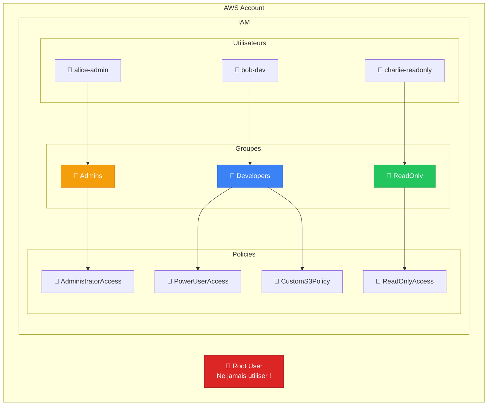
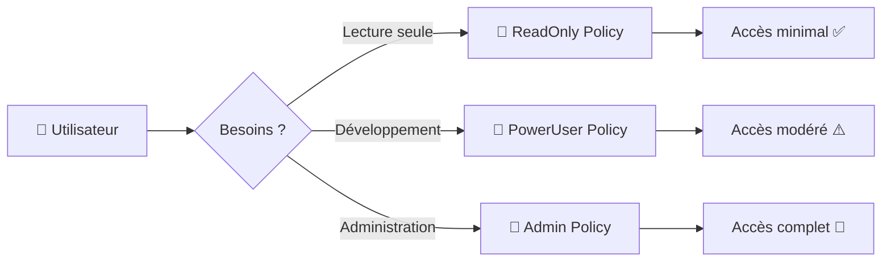
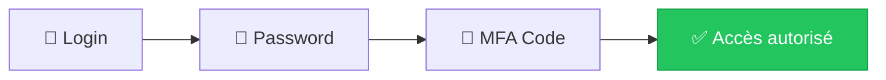

# Exercice 04 : Gestion des Identités avec AWS IAM

## 🎯 Objectifs pédagogiques

À la fin de cet exercice, vous serez capable de :
- Créer et gérer des utilisateurs IAM
- Créer des groupes et y associer des utilisateurs
- Comprendre et appliquer les politiques (policies) IAM
- Mettre en place le principe du moindre privilège
- Configurer l'authentification multi-facteur (MFA)

## 📚 Prérequis

- Compte AWS (Free Tier - IAM est 100% gratuit)
- Accès administrateur à la console AWS

## 💰 Coût

**GRATUIT** - IAM est un service sans frais supplémentaires.

## 🏗️ Architecture IAM



---

## 📖 Concepts Clés

### Le Principe du Moindre Privilège



> 💡 **Règle d'or** : Accordez toujours le minimum de permissions nécessaires pour effectuer une tâche.

### Structure d'une Policy IAM

```json
{
    "Version": "2012-10-17",
    "Statement": [
        {
            "Sid": "DescriptionUnique",
            "Effect": "Allow",
            "Action": [
                "s3:GetObject",
                "s3:ListBucket"
            ],
            "Resource": [
                "arn:aws:s3:::mon-bucket",
                "arn:aws:s3:::mon-bucket/*"
            ]
        }
    ]
}
```

| Élément | Description |
|---------|-------------|
| **Version** | Toujours "2012-10-17" |
| **Effect** | `Allow` ou `Deny` |
| **Action** | Les opérations autorisées (ex: `s3:GetObject`) |
| **Resource** | Les ressources concernées (ARN) |
| **Condition** | Conditions optionnelles (IP, MFA, etc.) |

---

## 📖 Partie 1 : Créer des Groupes IAM

### Étape 1 : Accéder à IAM

1. Connectez-vous à la console AWS
2. Recherchez et accédez au service **IAM**
3. Dans le menu latéral, cliquez sur **User groups**

### Étape 2 : Créer le groupe Admins

1. Cliquez sur **Create group**
2. Configurez :

| Paramètre | Valeur |
|-----------|--------|
| User group name | `Admins` |
| Attach policies | `AdministratorAccess` |

3. Cliquez sur **Create group**

### Étape 3 : Créer le groupe Developers

1. Créez un nouveau groupe `Developers`
2. Attachez les policies :
   - `PowerUserAccess`
   - `IAMUserChangePassword`

### Étape 4 : Créer le groupe ReadOnly

1. Créez un nouveau groupe `ReadOnly`
2. Attachez la policy :
   - `ReadOnlyAccess`

---

## 📖 Partie 2 : Créer des Utilisateurs IAM

### Étape 1 : Créer un utilisateur admin

1. Menu latéral → **Users** → **Create user**
2. Configurez :

| Paramètre | Valeur |
|-----------|--------|
| User name | `alice-admin` |
| Provide user access to the AWS Management Console | ✅ Coché |
| Console password | Custom password (sécurisé) |
| Users must create a new password at next sign-in | ✅ Coché |

3. **Set permissions** → **Add user to group** → Sélectionnez `Admins`
4. Cliquez sur **Create user**
5. **IMPORTANT** : Téléchargez ou copiez les credentials !

### Étape 2 : Créer un utilisateur développeur

Répétez avec :
- User name : `bob-dev`
- Groupe : `Developers`

### Étape 3 : Créer un utilisateur lecture seule

Répétez avec :
- User name : `charlie-readonly`
- Groupe : `ReadOnly`

---

## 📖 Partie 3 : Créer une Policy Personnalisée

Nous allons créer une policy qui autorise uniquement l'accès à un bucket S3 spécifique.

### Étape 1 : Créer la policy

1. Menu latéral → **Policies** → **Create policy**
2. Cliquez sur l'onglet **JSON**
3. Collez cette policy :

```json
{
    "Version": "2012-10-17",
    "Statement": [
        {
            "Sid": "ListAllBuckets",
            "Effect": "Allow",
            "Action": "s3:ListAllMyBuckets",
            "Resource": "*"
        },
        {
            "Sid": "AccessSpecificBucket",
            "Effect": "Allow",
            "Action": [
                "s3:GetObject",
                "s3:PutObject",
                "s3:DeleteObject",
                "s3:ListBucket"
            ],
            "Resource": [
                "arn:aws:s3:::mon-bucket-projet-*",
                "arn:aws:s3:::mon-bucket-projet-*/*"
            ]
        }
    ]
}
```

4. Cliquez sur **Next**
5. Configurez :

| Paramètre | Valeur |
|-----------|--------|
| Policy name | `CustomS3ProjectAccess` |
| Description | Accès limité aux buckets du projet |

6. Cliquez sur **Create policy**

### Étape 2 : Attacher la policy au groupe Developers

1. Allez dans **User groups** → **Developers**
2. Onglet **Permissions** → **Add permissions** → **Attach policies**
3. Recherchez `CustomS3ProjectAccess`
4. Sélectionnez et cliquez sur **Attach policies**

---

## 📖 Partie 4 : Configurer MFA (Multi-Factor Authentication)



### Étape 1 : Activer MFA pour un utilisateur

1. Menu latéral → **Users** → Sélectionnez `alice-admin`
2. Onglet **Security credentials**
3. Section **Multi-factor authentication (MFA)** → **Assign MFA device**
4. Choisissez **Authenticator app**
5. Suivez les instructions :
   - Scannez le QR code avec une app (Google Authenticator, Authy, etc.)
   - Entrez deux codes consécutifs pour vérifier
6. Cliquez sur **Add MFA**

---

## 📖 Partie 5 : Tester les Permissions

### Test 1 : Connexion avec charlie-readonly

1. Ouvrez une fenêtre de navigation privée
2. Allez sur : `https://ACCOUNT_ID.signin.aws.amazon.com/console`
3. Connectez-vous avec `charlie-readonly`
4. Essayez de :
   - ✅ Lister les buckets S3 → Devrait fonctionner
   - ❌ Créer un bucket → Devrait échouer
   - ❌ Lancer une instance EC2 → Devrait échouer

### Test 2 : Connexion avec bob-dev

1. Connectez-vous avec `bob-dev`
2. Essayez de :
   - ✅ Créer un bucket S3 commençant par `mon-bucket-projet-`
   - ✅ Lancer une instance EC2
   - ❌ Modifier les policies IAM → Devrait échouer

---

## ✅ Validation de l'exercice

### Checklist

- [ ] 3 groupes créés (Admins, Developers, ReadOnly)
- [ ] 3 utilisateurs créés et assignés aux groupes
- [ ] Policy personnalisée créée et attachée
- [ ] MFA activé sur au moins un utilisateur
- [ ] Tests de permissions effectués

### Quiz de validation

1. **Pourquoi ne faut-il jamais utiliser le compte root ?**
   <details>
   <summary>Réponse</summary>
   Le compte root a un accès illimité et ne peut pas être restreint. Une compromission = perte totale du compte.
   </details>

2. **Quelle est la différence entre une policy attachée à un groupe vs un utilisateur ?**
   <details>
   <summary>Réponse</summary>
   Les policies sur un groupe s'appliquent à tous les membres automatiquement. Plus facile à gérer à grande échelle.
   </details>

3. **Que signifie "Effect": "Deny" dans une policy ?**
   <details>
   <summary>Réponse</summary>
   Deny est prioritaire sur Allow. Même si une autre policy autorise, le Deny bloquera l'action.
   </details>

---

## 🧹 Nettoyage

1. Supprimer les utilisateurs (Users → Select → Delete)
2. Supprimer les groupes (User groups → Select → Delete)
3. Supprimer les policies personnalisées (Policies → Filter: Customer managed → Delete)

---

## 🚀 Challenges Bonus

### Challenge 1 : Policy avec condition IP

Créez une policy qui n'autorise l'accès que depuis une IP spécifique.

```json
{
    "Version": "2012-10-17",
    "Statement": [
        {
            "Effect": "Allow",
            "Action": "*",
            "Resource": "*",
            "Condition": {
                "IpAddress": {
                    "aws:SourceIp": "203.0.113.0/24"
                }
            }
        }
    ]
}
```

### Challenge 2 : Policy avec condition MFA

Exigez MFA pour les actions sensibles :

```json
{
    "Version": "2012-10-17",
    "Statement": [
        {
            "Effect": "Allow",
            "Action": "ec2:TerminateInstances",
            "Resource": "*",
            "Condition": {
                "Bool": {
                    "aws:MultiFactorAuthPresent": "true"
                }
            }
        }
    ]
}
```

---

## 📚 Pour aller plus loin

- [IAM Best Practices](https://docs.aws.amazon.com/IAM/latest/UserGuide/best-practices.html)
- [Policy Simulator](https://policysim.aws.amazon.com/) - Testez vos policies
- [IAM Access Analyzer](https://docs.aws.amazon.com/IAM/latest/UserGuide/what-is-access-analyzer.html)
- [AWS Organizations](https://docs.aws.amazon.com/organizations/) - Gestion multi-compte
