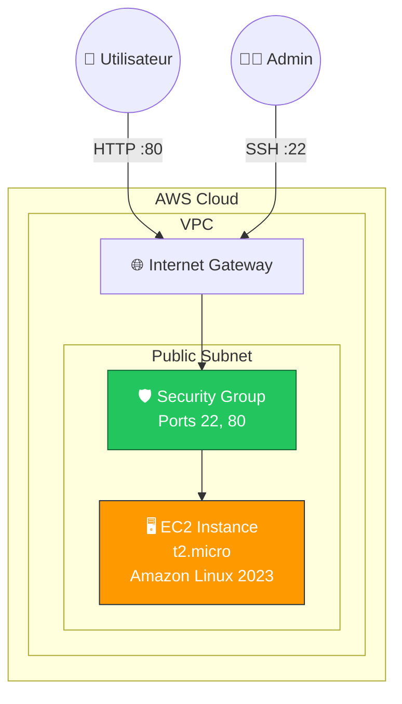
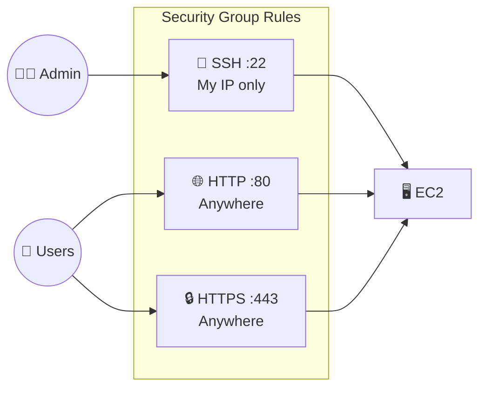
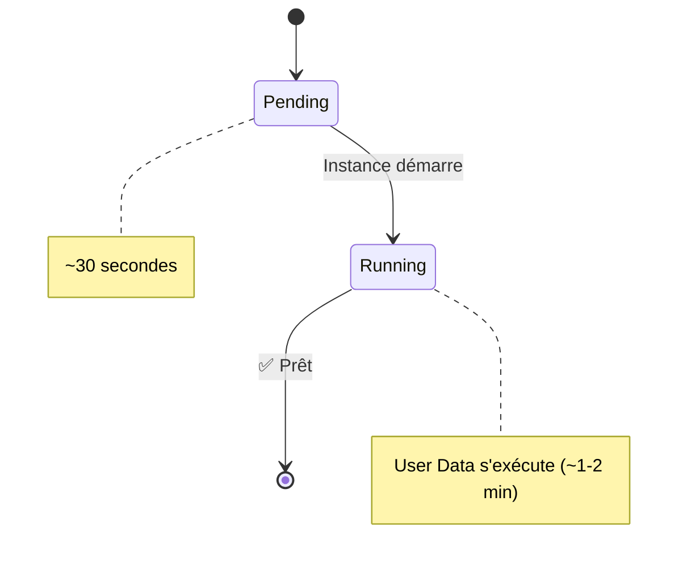

# Exercice 05 : Lancer un Serveur Web EC2 avec User Data

## 🎯 Objectifs pédagogiques

À la fin de cet exercice, vous serez capable de :
- Lancer une instance EC2 dans le Free Tier
- Utiliser User Data pour automatiser la configuration
- Configurer les Security Groups pour le trafic web
- Accéder à votre serveur web depuis Internet
- Gérer les clés SSH pour l'accès distant

## 📚 Prérequis

- Compte AWS (Free Tier)
- Exercice 01 complété (VPC) - ou utiliser le VPC par défaut

## 💰 Coût Free Tier

| Service | Inclus Free Tier |
|---------|------------------|
| EC2 t2.micro/t3.micro | 750 heures/mois pendant 12 mois |
| EBS (stockage) | 30 Go par mois |
| Transfert données | 100 Go sortant/mois |

> ⚠️ **Important** : Arrêtez ou terminez vos instances après l'exercice pour ne pas consommer vos heures gratuites.

## 🏗️ Architecture



---

## 📖 Partie 1 : Créer une Paire de Clés SSH

### Étape 1 : Générer la clé

1. Accédez à **EC2** → **Key Pairs** (menu latéral)
2. Cliquez sur **Create key pair**
3. Configurez :

| Paramètre | Valeur |
|-----------|--------|
| Name | `ma-premiere-cle` |
| Key pair type | RSA |
| Private key file format | .pem (macOS/Linux) ou .ppk (Windows/PuTTY) |

4. Cliquez sur **Create key pair**
5. Le fichier `.pem` se télécharge automatiquement

### Étape 2 : Sécuriser la clé (macOS/Linux)

```bash
# Déplacer la clé dans un endroit sûr
mv ~/Downloads/ma-premiere-cle.pem ~/.ssh/

# Restreindre les permissions (obligatoire)
chmod 400 ~/.ssh/ma-premiere-cle.pem
```

---

## 📖 Partie 2 : Créer le Security Group

### Étape 1 : Créer le Security Group

1. **EC2** → **Security Groups** → **Create security group**
2. Configurez :

| Paramètre | Valeur |
|-----------|--------|
| Security group name | `web-server-sg` |
| Description | Allow SSH and HTTP access |
| VPC | Votre VPC (ou default) |

### Étape 2 : Configurer les règles entrantes

| Type | Protocol | Port | Source | Description |
|------|----------|------|--------|-------------|
| SSH | TCP | 22 | My IP | SSH access |
| HTTP | TCP | 80 | 0.0.0.0/0 | Web traffic |
| HTTPS | TCP | 443 | 0.0.0.0/0 | Secure web traffic |

3. Cliquez sur **Create security group**



---

## 📖 Partie 3 : Lancer l'Instance EC2

### Étape 1 : Launch Instance

1. **EC2** → **Instances** → **Launch instances**

### Étape 2 : Configuration

#### Nom et tags
| Paramètre | Valeur |
|-----------|--------|
| Name | `mon-premier-serveur-web` |

#### AMI (Amazon Machine Image)
- Sélectionnez **Amazon Linux 2023 AMI** (Free tier eligible)
- Architecture : 64-bit (x86)

#### Instance Type
- Sélectionnez **t2.micro** ou **t3.micro** (Free tier eligible)

#### Key Pair
- Sélectionnez `ma-premiere-cle`

#### Network settings
- Cliquez sur **Edit**

| Paramètre | Valeur |
|-----------|--------|
| VPC | Votre VPC |
| Subnet | Public subnet |
| Auto-assign public IP | Enable |
| Security group | Select existing: `web-server-sg` |

#### Configure storage
- 8 Go gp3 (par défaut, suffisant pour cet exercice)

### Étape 3 : User Data (Script de démarrage)

Développez **Advanced details** et scrollez jusqu'à **User data**.

Collez ce script :

```bash
#!/bin/bash
# Script User Data - Installation serveur web

# Mise à jour du système
yum update -y

# Installation Apache
yum install -y httpd

# Démarrage et activation du service
systemctl start httpd
systemctl enable httpd

# Récupération des métadonnées de l'instance
TOKEN=$(curl -X PUT "http://169.254.169.254/latest/api/token" -H "X-aws-ec2-metadata-token-ttl-seconds: 21600")
INSTANCE_ID=$(curl -H "X-aws-ec2-metadata-token: $TOKEN" http://169.254.169.254/latest/meta-data/instance-id)
AVAILABILITY_ZONE=$(curl -H "X-aws-ec2-metadata-token: $TOKEN" http://169.254.169.254/latest/meta-data/placement/availability-zone)
PUBLIC_IP=$(curl -H "X-aws-ec2-metadata-token: $TOKEN" http://169.254.169.254/latest/meta-data/public-ipv4)

# Création de la page web
cat <<EOF > /var/www/html/index.html
<!DOCTYPE html>
<html lang="fr">
<head>
    <meta charset="UTF-8">
    <meta name="viewport" content="width=device-width, initial-scale=1.0">
    <title>Mon Premier Serveur AWS</title>
    <script src="https://cdn.tailwindcss.com"></script>
</head>
<body class="bg-gradient-to-br from-gray-900 to-gray-800 min-h-screen flex items-center justify-center p-4">
    <div class="max-w-2xl w-full">
        <div class="bg-white/10 backdrop-blur-lg rounded-3xl p-8 shadow-2xl border border-white/20">
            <div class="text-center mb-8">
                <div class="inline-flex items-center justify-center w-20 h-20 bg-gradient-to-br from-orange-500 to-yellow-500 rounded-2xl mb-4">
                    <svg class="w-10 h-10 text-white" fill="none" stroke="currentColor" viewBox="0 0 24 24">
                        <path stroke-linecap="round" stroke-linejoin="round" stroke-width="2" d="M5 12h14M5 12a2 2 0 01-2-2V6a2 2 0 012-2h14a2 2 0 012 2v4a2 2 0 01-2 2M5 12a2 2 0 00-2 2v4a2 2 0 002 2h14a2 2 0 002-2v-4a2 2 0 00-2-2m-2-4h.01M17 16h.01"/>
                    </svg>
                </div>
                <h1 class="text-4xl font-bold text-white mb-2">🎉 Félicitations !</h1>
                <p class="text-xl text-gray-300">Votre serveur web AWS fonctionne !</p>
            </div>
            
            <div class="space-y-4">
                <div class="bg-white/5 rounded-xl p-4 border border-white/10">
                    <div class="flex items-center space-x-3">
                        <span class="text-2xl">🏷️</span>
                        <div>
                            <p class="text-gray-400 text-sm">Instance ID</p>
                            <p class="text-white font-mono">$INSTANCE_ID</p>
                        </div>
                    </div>
                </div>
                
                <div class="bg-white/5 rounded-xl p-4 border border-white/10">
                    <div class="flex items-center space-x-3">
                        <span class="text-2xl">📍</span>
                        <div>
                            <p class="text-gray-400 text-sm">Availability Zone</p>
                            <p class="text-white font-mono">$AVAILABILITY_ZONE</p>
                        </div>
                    </div>
                </div>
                
                <div class="bg-white/5 rounded-xl p-4 border border-white/10">
                    <div class="flex items-center space-x-3">
                        <span class="text-2xl">🌐</span>
                        <div>
                            <p class="text-gray-400 text-sm">Public IP</p>
                            <p class="text-white font-mono">$PUBLIC_IP</p>
                        </div>
                    </div>
                </div>
            </div>
            
            <div class="mt-8 p-4 bg-green-500/20 rounded-xl border border-green-500/30">
                <p class="text-green-400 text-center">
                    ✅ Ce serveur a été configuré automatiquement via <strong>User Data</strong>
                </p>
            </div>
            
            <div class="mt-6 text-center text-gray-500 text-sm">
                <p>Exercice 05 - Formation AWS Cloud</p>
                <p>Généré le $(date '+%d/%m/%Y à %H:%M:%S')</p>
            </div>
        </div>
    </div>
</body>
</html>
EOF

echo "✅ Installation terminée !"
```

### Étape 4 : Lancer l'instance

1. Vérifiez le résumé dans le panneau de droite
2. Cliquez sur **Launch instance**

---

## 📖 Partie 4 : Accéder à votre Serveur

### Attendre le démarrage



1. Attendez que l'état passe à **Running**
2. Attendez que **Status checks** affiche **2/2 checks passed**

### Accès HTTP (Web)

1. Copiez l'**Public IPv4 address** de votre instance
2. Ouvrez dans votre navigateur : `http://VOTRE_IP_PUBLIQUE`
3. 🎉 Vous devriez voir votre page web !

### Accès SSH (Administration)

```bash
# Connexion SSH
ssh -i ~/.ssh/ma-premiere-cle.pem ec2-user@VOTRE_IP_PUBLIQUE

# Une fois connecté, vérifiez Apache
sudo systemctl status httpd

# Voir les logs User Data
sudo cat /var/log/cloud-init-output.log
```

---

## 📖 Partie 5 : Explorer les Métadonnées

Une fois connecté en SSH, explorez les métadonnées de l'instance :

```bash
# Obtenir un token (IMDSv2)
TOKEN=$(curl -X PUT "http://169.254.169.254/latest/api/token" \
  -H "X-aws-ec2-metadata-token-ttl-seconds: 21600")

# Instance ID
curl -H "X-aws-ec2-metadata-token: $TOKEN" \
  http://169.254.169.254/latest/meta-data/instance-id

# Type d'instance
curl -H "X-aws-ec2-metadata-token: $TOKEN" \
  http://169.254.169.254/latest/meta-data/instance-type

# AMI ID
curl -H "X-aws-ec2-metadata-token: $TOKEN" \
  http://169.254.169.254/latest/meta-data/ami-id

# Security Groups
curl -H "X-aws-ec2-metadata-token: $TOKEN" \
  http://169.254.169.254/latest/meta-data/security-groups

# Voir tout
curl -H "X-aws-ec2-metadata-token: $TOKEN" \
  http://169.254.169.254/latest/meta-data/
```

---

## ✅ Validation de l'exercice

### Checklist

- [ ] Paire de clés SSH créée et téléchargée
- [ ] Security Group configuré (SSH + HTTP)
- [ ] Instance EC2 lancée (t2.micro, Free Tier)
- [ ] User Data exécuté avec succès
- [ ] Page web accessible via le navigateur
- [ ] Connexion SSH fonctionnelle

### Captures à réaliser

1. Screenshot de votre page web dans le navigateur
2. Screenshot du terminal SSH connecté à l'instance
3. Screenshot de la console EC2 montrant l'instance Running

---

## 🧹 Nettoyage

**IMPORTANT** : Pour ne pas consommer vos heures Free Tier inutilement !

### Option 1 : Arrêter l'instance (conserve les données)

```bash
# Via CLI
aws ec2 stop-instances --instance-ids i-xxxxxxxxxxxx
```

Ou via la console : **Instance** → **Instance state** → **Stop instance**

### Option 2 : Terminer l'instance (supprime tout)

```bash
# Via CLI
aws ec2 terminate-instances --instance-ids i-xxxxxxxxxxxx
```

Ou via la console : **Instance** → **Instance state** → **Terminate instance**

### Nettoyage complet

1. Terminez l'instance EC2
2. Supprimez le Security Group (après avoir terminé l'instance)
3. Supprimez la Key Pair (optionnel, gardez-la pour de futurs exercices)

---

## 🚀 Challenges Bonus

### Challenge 1 : Ajouter HTTPS avec un certificat auto-signé

Modifiez le User Data pour installer mod_ssl et générer un certificat.

### Challenge 2 : Installer une application

Modifiez le script pour installer WordPress, Node.js, ou une autre application.

### Challenge 3 : Elastic IP

Associez une Elastic IP pour avoir une IP fixe même après redémarrage.

### Challenge 4 : CloudWatch Monitoring

Activez le monitoring détaillé et créez une alarme CPU.

---

## 📚 Pour aller plus loin

- [EC2 User Guide](https://docs.aws.amazon.com/ec2/)
- [Instance Metadata Service](https://docs.aws.amazon.com/AWSEC2/latest/UserGuide/ec2-instance-metadata.html)
- [EC2 Instance Types](https://aws.amazon.com/ec2/instance-types/)
- [Auto Scaling](https://docs.aws.amazon.com/autoscaling/) - Prochain niveau !
